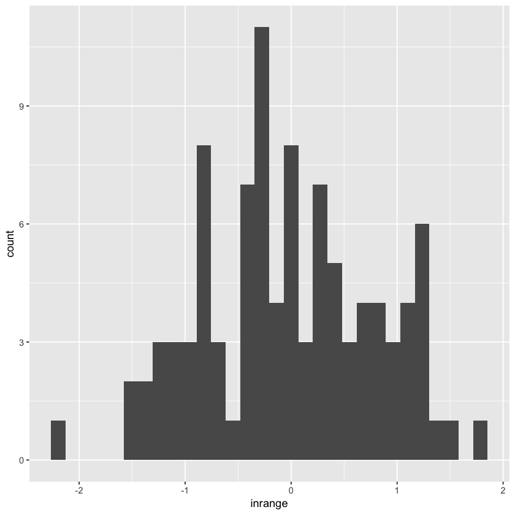
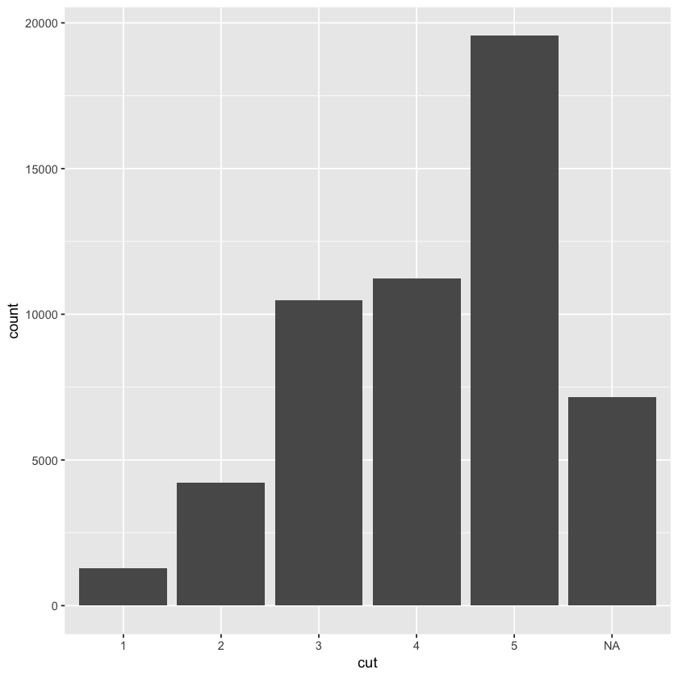

## 7.4.1 Exercise

## Missing Values 


```R
library(tidyverse)
```

1.	What happens to missing values in a histogram? What happens to missing values in a bar chart? Why is there a difference?

In a bar chart, NA is considered as just another category. In a histogram, NA is ignored because the x exis has order.


```R
set.seed(0)
df <- tibble(norm = rnorm(100)) %>% mutate(inrange = ifelse(norm > 2, NA, norm))
ggplot(df) +
  geom_histogram(aes(x = inrange))
```

    `stat_bin()` using `bins = 30`. Pick better value with `binwidth`.
    Warning message:
    “Removed 2 rows containing non-finite values (stat_bin).”





geom_histogram() removed rows with NA values;


```R
df <- diamonds %>% mutate(cut = as.factor(ifelse(y > 7, NA, cut)))
ggplot(df) + geom_bar(aes(x = cut))
```





Apparently geom_bar() doesn’t remove NA, but rather treat it as another factor or category.

2.	What does na.rm = TRUE do in mean() and sum()?

To ignore NAs when calculating mean and sum.

