## 7.5.1 Exercise

## A Categorical and Continuous Variable


```R
library(tidyverse)
# install.packages("nycflights13")
library(nycflights13)
```

    Updating HTML index of packages in '.Library'
    Making 'packages.html' ... done


1.	Use what you’ve learned to improve the visualisation of the departure times of cancelled vs. non-cancelled flights.


```R
flights %>% 
  mutate(cancelled = is.na(dep_time) | is.na(arr_time)) %>% 
  ggplot() +
  geom_boxplot(aes(x = cancelled, y = dep_time))
```

    Warning message:
    “Removed 8255 rows containing non-finite values (stat_boxplot).”


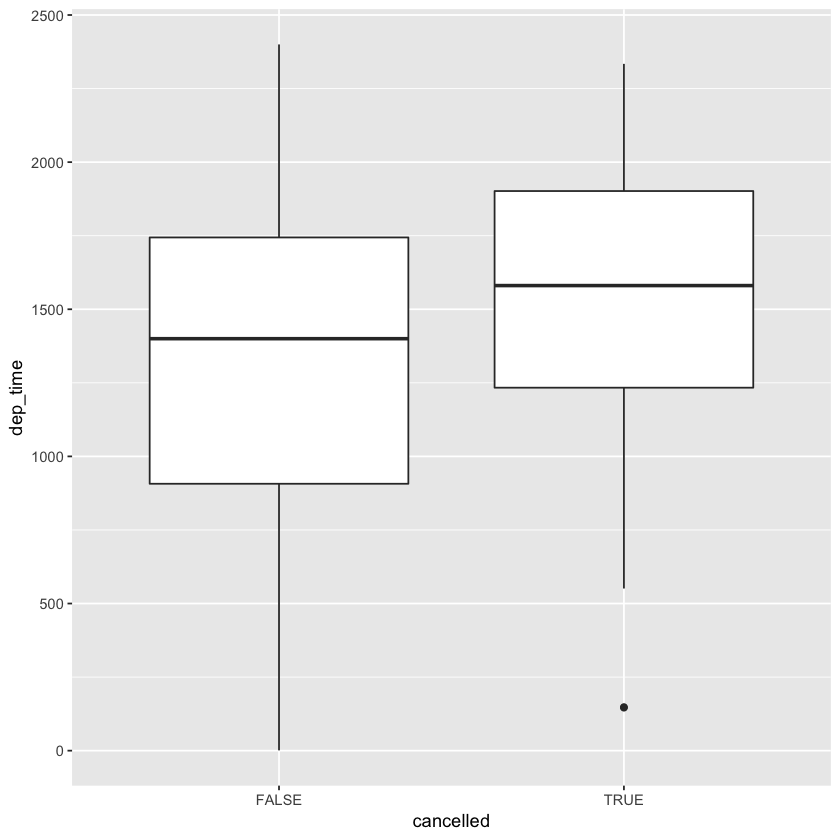


```R
flights %>% 
  mutate(cancelled = is.na(dep_time) | is.na(arr_time)) %>% 
  filter(cancelled) %>% 
  select(dep_time)
```


<table>
<thead><tr><th scope=col>dep_time</th></tr></thead>
<tbody>
	<tr><td>2016</td></tr>
	<tr><td>  NA</td></tr>
	<tr><td>  NA</td></tr>
	<tr><td>  NA</td></tr>
	<tr><td>  NA</td></tr>
	<tr><td>2041</td></tr>
	<tr><td>2145</td></tr>
	<tr><td>  NA</td></tr>
	<tr><td>  NA</td></tr>
	<tr><td>  NA</td></tr>
	<tr><td>  NA</td></tr>
	<tr><td>  NA</td></tr>
	<tr><td>  NA</td></tr>
	<tr><td>  NA</td></tr>
	<tr><td>  NA</td></tr>
	<tr><td>  NA</td></tr>
	<tr><td>  NA</td></tr>
	<tr><td>  NA</td></tr>
	<tr><td>  NA</td></tr>
	<tr><td>  NA</td></tr>
	<tr><td>  NA</td></tr>
	<tr><td>  NA</td></tr>
	<tr><td>  NA</td></tr>
	<tr><td>  NA</td></tr>
	<tr><td>  NA</td></tr>
	<tr><td>  NA</td></tr>
	<tr><td>  NA</td></tr>
	<tr><td>  NA</td></tr>
	<tr><td>  NA</td></tr>
	<tr><td>  NA</td></tr>
	<tr><td>...</td></tr>
	<tr><td>  NA</td></tr>
	<tr><td>  NA</td></tr>
	<tr><td>  NA</td></tr>
	<tr><td>  NA</td></tr>
	<tr><td>  NA</td></tr>
	<tr><td>  NA</td></tr>
	<tr><td>  NA</td></tr>
	<tr><td>  NA</td></tr>
	<tr><td>  NA</td></tr>
	<tr><td>  NA</td></tr>
	<tr><td>  NA</td></tr>
	<tr><td>  NA</td></tr>
	<tr><td>2253</td></tr>
	<tr><td>  NA</td></tr>
	<tr><td>  NA</td></tr>
	<tr><td>  NA</td></tr>
	<tr><td>  NA</td></tr>
	<tr><td>  NA</td></tr>
	<tr><td>  NA</td></tr>
	<tr><td>  NA</td></tr>
	<tr><td>  NA</td></tr>
	<tr><td>  NA</td></tr>
	<tr><td>  NA</td></tr>
	<tr><td> 559</td></tr>
	<tr><td>  NA</td></tr>
	<tr><td>  NA</td></tr>
	<tr><td>  NA</td></tr>
	<tr><td>  NA</td></tr>
	<tr><td>  NA</td></tr>
	<tr><td>  NA</td></tr>
</tbody>
</table>


Puzzled by this question: how do we have departure times of cancelled flights?

2.	What variable in the diamonds dataset is most important for predicting the price of a diamond? How is that variable correlated with cut? Why does the combination of those two relationships lead to lower quality diamonds being more expensive?


```R
ggplot(diamonds) +
  geom_point(aes(x = carat, y = price), color = "blue", alpha = 0.5)
```


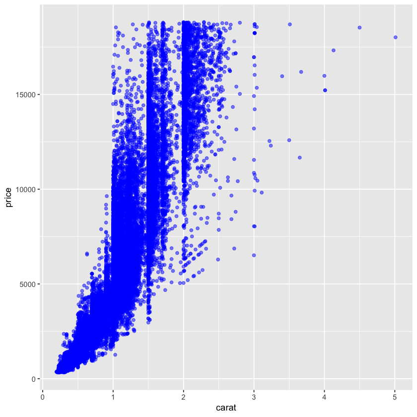


```R
ggplot(diamonds) +
  geom_point(aes(x = depth, y = price), color = "red", alpha = 0.5)
```


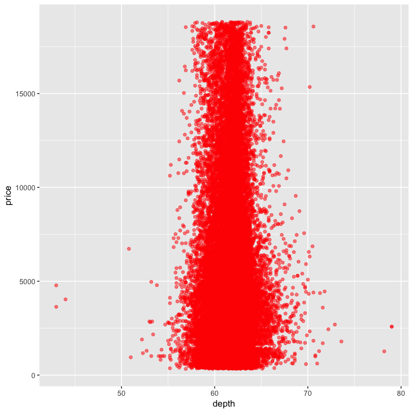


```R
ggplot(diamonds) +
  geom_point(aes(x = table, y = price), color = "red", alpha = 0.5)
```


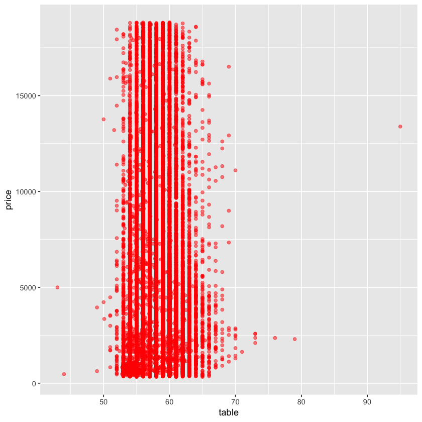


```R
ggplot(diamonds) +
  geom_point(aes(x = x, y = price), color = "red", alpha = 0.5)
```


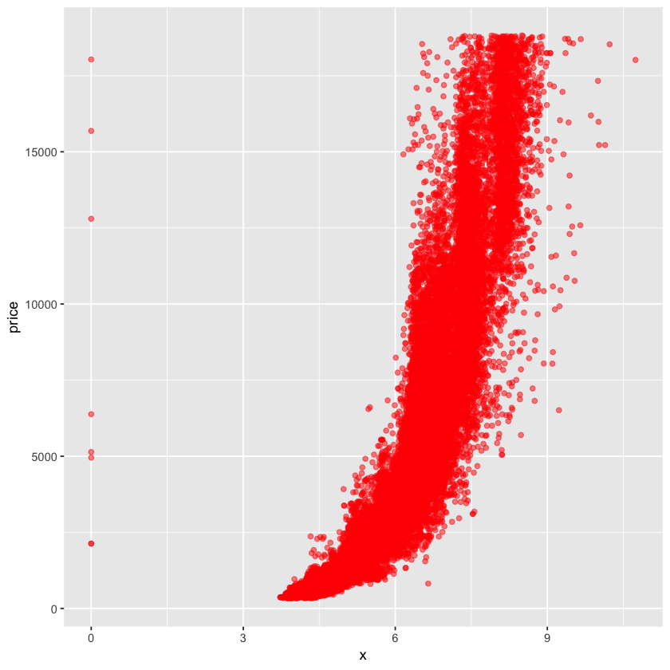


```R
ggplot(diamonds) +
  geom_point(aes(x = z, y = price), color = "red", alpha = 0.5)
```


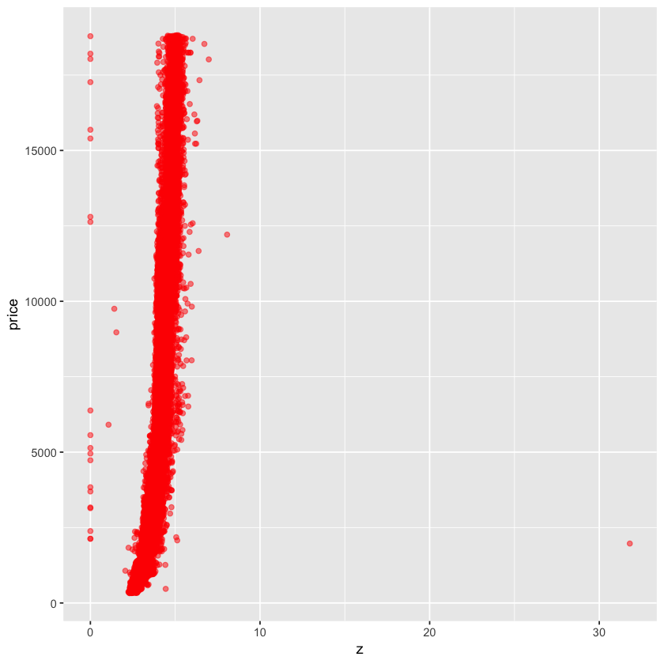


Volumn and weight are two variables that is most important for predicting the price. Since volumn is highly correlated with weight, they can be considered to be one variable.


```R
ggplot(diamonds) +
  geom_boxplot(aes(x = cut, y = carat))
```


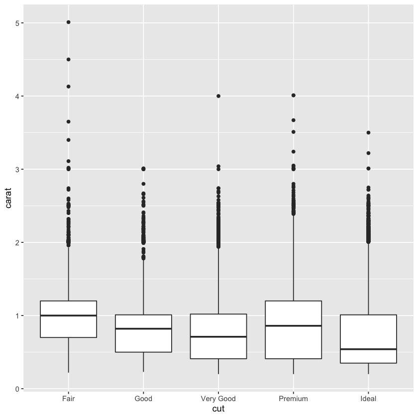


Because better cut has lower carat which makes their price lower, so if we don’t look at carat, it would appear that better cut has lower price.

3.	Install the ggstance package, and create a horizontal boxplot. How does this compare to using coord_flip()?


```R
# install.packages("ggstance")
# update.packages()
library(ggstance)
```


```R
ggplot(diamonds) + geom_boxplot(aes(x = cut, y = carat)) + coord_flip()
```


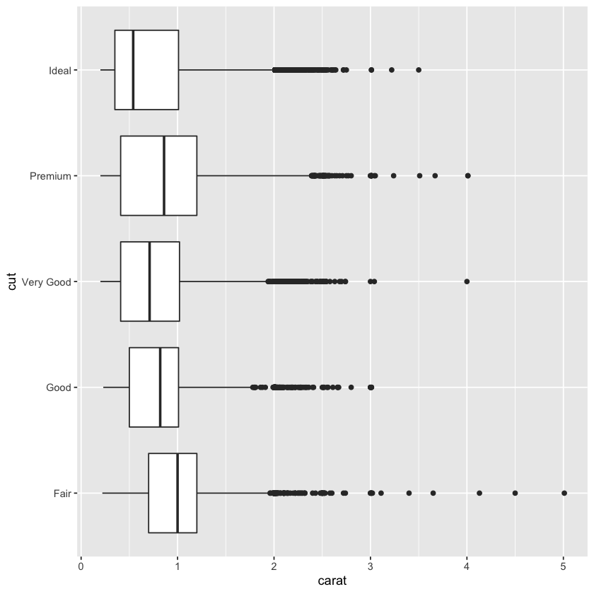


```R
ggplot(diamonds) + geom_boxploth(aes(x = carat, y = cut))
```


Seems like the result is the same; but the call of the function seems more natural.

4.	One problem with boxplots is that they were developed in an era of much smaller datasets and tend to display a prohibitively large number of “outlying values”. One approach to remedy this problem is the letter value plot. Install the lvplot package, and try using geom_lv() to display the distribution of price vs cut. What do you learn? How do you interpret the plots?


```R
# install.packages("lvplot")
library(lvplot)
ggplot(diamonds) + geom_lv(aes(x = cut, y = price))
```

    Updating HTML index of packages in '.Library'
    Making 'packages.html' ... done


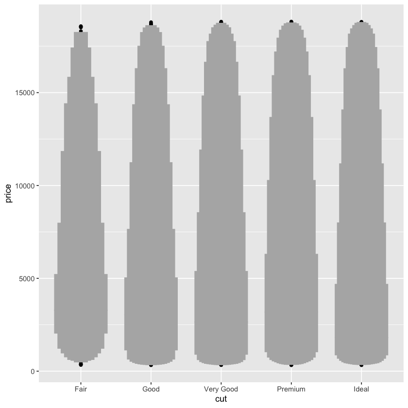


While the boxplot only shows a few quantiles and outliers, the letter-value plot shows many quantiles.

5.	Compare and contrast geom_violin() with a facetted geom_histogram(), or a coloured geom_freqpoly(). What are the pros and cons of each method?


```R
ggplot(diamonds) +
  geom_histogram(aes(x = price)) +
  facet_wrap(~cut)
```

    `stat_bin()` using `bins = 30`. Pick better value with `binwidth`.


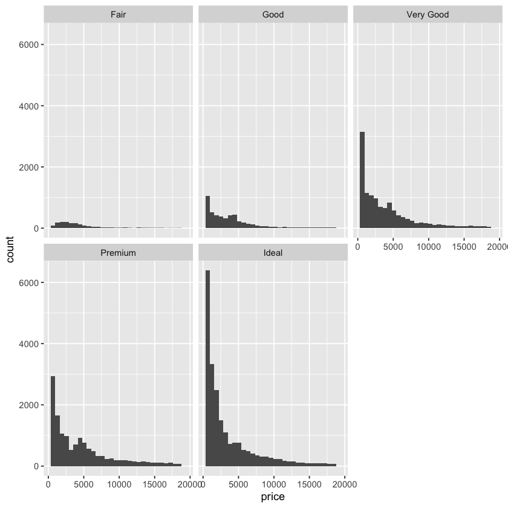


```R
ggplot(diamonds) +
  geom_freqpoly(aes(x = price)) +
  facet_wrap(~cut)
```

    `stat_bin()` using `bins = 30`. Pick better value with `binwidth`.


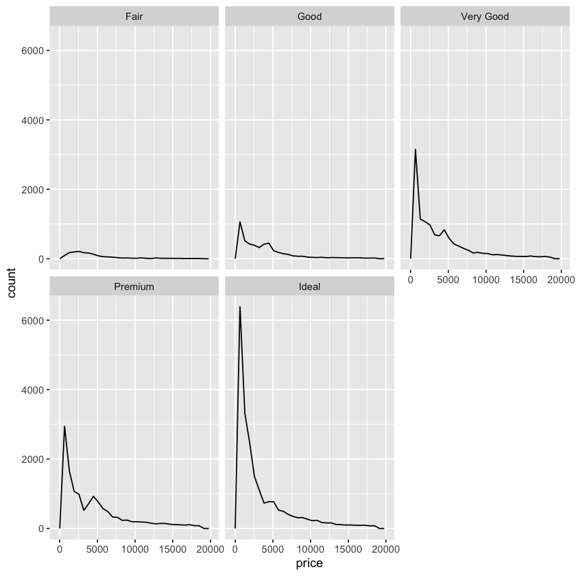


```R
ggplot(diamonds) +
  geom_violin(aes(x = cut, y = price))
```


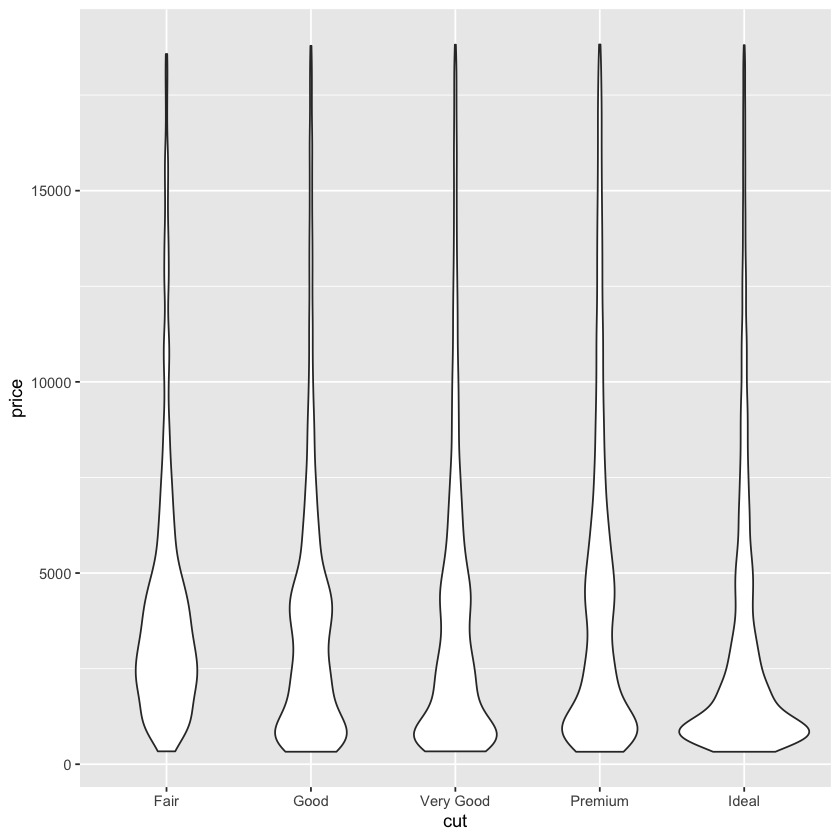


```R
ggplot(diamonds) +
  geom_lv(aes(x = cut, y = price))
```


Violin plot is best to compare the density distribution across different categories.

6.	If you have a small dataset, it’s sometimes useful to use geom_jitter() to see the relationship between a continuous and categorical variable. The ggbeeswarm package provides a number of methods similar to geom_jitter(). List them and briefly describe what each one does.


```R
ggplot(mpg, aes(cyl, hwy)) + geom_jitter()
```


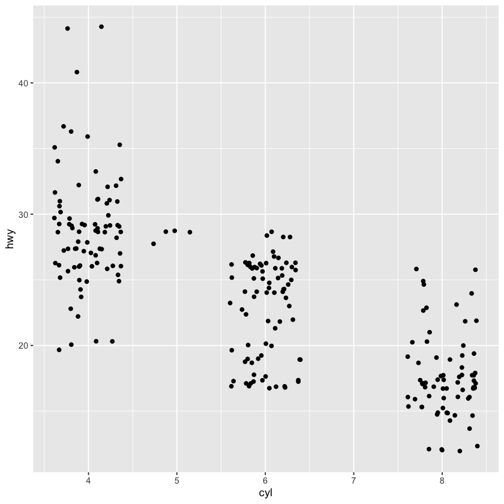


```R
# install.packages("ggbeeswarm")
library(ggbeeswarm)
```


```R
ggplot(mpg, aes(cyl, hwy)) + geom_quasirandom()
```


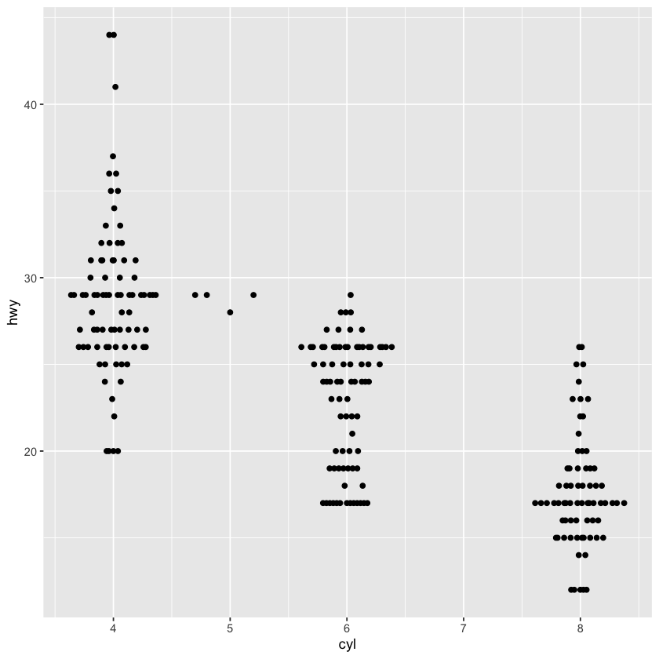


```R

```


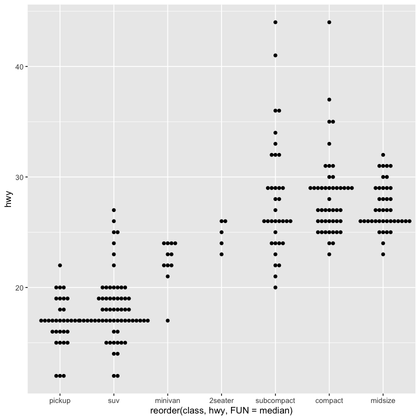


