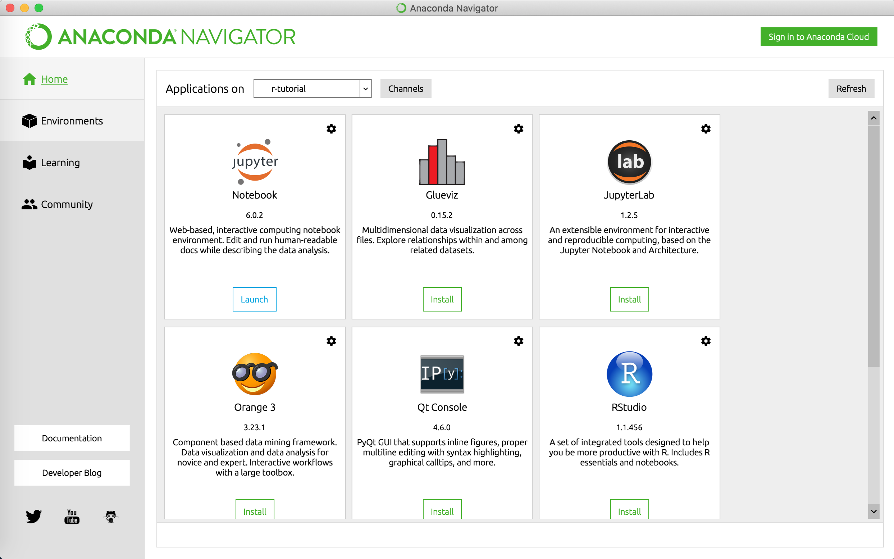
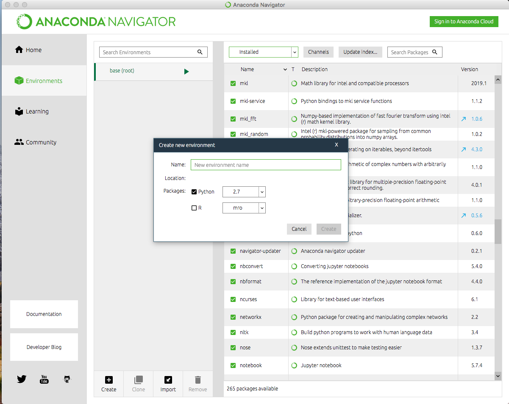
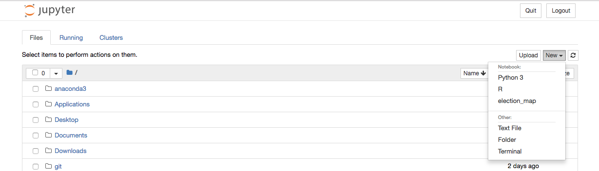

## Installation documentation

Traditionally, the Jupyter notebook can be installed to run Python data analysis. And it’s also convenient to install R studio from the official website for R data analysis. More conveniently, It’s recommended to use Anaconda to integrate both Python and R in JupytherLab, which avoids many installation problems.

## 1 What is JupyterLab

**JupyterLab** is the next generation of the Jupyter Notebook. It aims at fixing many usability issues of the Notebook, and it greatly expands its scope. JupyterLab offers a general framework for interactive computing and data science in the browser, using Python, Julia, R, or one of many other languages.

If you are using both Python2.7 and Python3, you may have dependency packet conflict problems using ```pip```, the installation of conda to setup jupyterlab is recommended.

## 1.1 Installation

JupyterLab can be installed using `conda` or `pip`. For more detailed instructions, consult the [installation guide](https://jupyterlab.readthedocs.io/en/stable/getting_started/installation.html).

### conda

If you use conda, or [install miniconda](https://docs.conda.io/en/latest/miniconda.html)

```
conda install -c conda-forge jupyterlab
```

I recommend installing [Anacoda3](https://www.anaconda.com/distribution/) to help integrate R into Jupyterlab

### pip

If you use `pip`, you can install it with:

```
pip install jupyterlab
```

If installing using `pip install --user`, you must add the user-level `bin` directory to your `PATH` environment variable in order to launch `jupyter lab`.


### 1.2 Check installation package dependencies

```
jupyter --version
```

If the fllowing results appear, that means it works.

```
jupyter core     : 4.6.1
jupyter-notebook : 6.0.3
qtconsole        : not installed
ipython          : 7.11.1
ipykernel        : 5.1.3
jupyter client   : 5.3.4
jupyter lab      : 1.2.5
nbconvert        : 5.6.1
ipywidgets       : not installed
nbformat         : 5.0.4
traitlets        : 4.3.3
```

### 1.3 Run the Jupterlab

```
jupyter lab
```

You may access JupyterLab by entering the notebook server’s [URL](https://jupyterlab.readthedocs.io/en/stable/user/urls.html#urls) into the browser. JupyterLab sessions always reside in a [workspace](https://jupyterlab.readthedocs.io/en/stable/user/urls.html#url-workspaces-ui). The default workspace is the main `/lab` URL:

```
http(s)://<server:port>/<lab-location>/lab
```


## 2 Install the standalone R

If you want to install R separately, instead of using JupyterLab, you can [visit the R official website](https://www.r-project.org/) and choose the corresponding system version to download and install directly.


## 3 Install Python and R with Anaconda

### 3.1 Install Anaconda

The open-source [Anaconda Distribution](https://docs.anaconda.com/anaconda/) is the easiest way to perform Python/R data science and machine learning on Linux, Windows, and Mac OS X. 



### 3.2 Integrate R into Jupyter

- Create a new environment and select the Python and R options. 



- [Open the environment with the R package](https://docs.anaconda.com/anaconda/navigator/getting-started/#navigator-use-environment) using the Open with Jupyter Notebook option. 


- To create a new notebook for the R language, in the Jupyter Notebook menu, select **New**, then select **R**.




 More detail [Click Here](https://docs.anaconda.com/anaconda/navigator/tutorials/r-lang/)


**Enjoy playing with JupyterLab!!!**


## 4 Reference

[1] McKinney W. Python for data analysis: Data wrangling with Pandas, NumPy, and IPython. " O'Reilly Media, Inc."; 2012 Oct 8.

[2] https://jupyter.org


