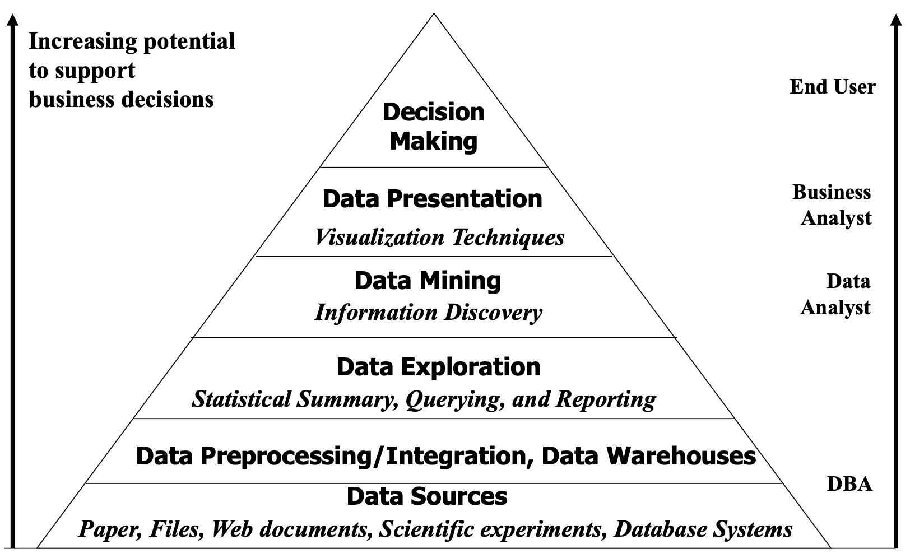

### What is Data Mining?

**Data mining** is a process to discover, by automatic or semi-automatic means, interesting, previously unknown, implicit, potentially useful, and non-trivial patterns or knowledge from large quantities of data.

### Data Mining in Business Decisions

### Essential Python Library

#### NumPy

NumPy, short for Numerical Python, is the foundational package for scientific com- puting in Python.

#### pandas

pandas provides rich data structures and functions designed to make working with structured data fast, easy, and expressive.

#### matplotlib

matplotlib is the most popular Python library for producing plots and other 2D data visualizations. 

#### IPython

IPython is the component in the standard scientific Python toolset that ties everything together. It provides a robust and productive environment for interactive and explor- atory computing. It is an enhanced Python shell designed to accelerate the writing, testing, and debugging of Python code. It is particularly useful for interactively working with data and visualizing data with matplotlib. IPython is usually involved with the majority of my Python work, including running, debugging, and testing code.

#### SciPy

SciPy is a collection of packages addressing a number of different standard problem domains in scientific computing. Here is a sampling of the packages included:

- scipy.integrate: numerical integration routines and differential equation solvers

- scipy.linalg: linear algebra routines and matrix decompositions extending be-

  yond those provided in numpy.linalg.

- scipy.optimize: function optimizers (minimizers) and root finding algorithms

- scipy.signal: signal processing tools

- scipy.sparse: sparse matrices and sparse linear system solvers

- scipy.special: wrapper around SPECFUN, a Fortran library implementing many common mathematical functions, such as the gamma function

- scipy.stats: standard continuous and discrete probability distributions (density functions, samplers, continuous distribution functions), various statistical tests, and more descriptive statistics

- scipy.weave: tool for using inline C++ code to accelerate array computations 

Together NumPy and SciPy form a reasonably complete computational replacement for much of MATLAB along with some of its add-on toolboxes.

### Reference

[1] J. Han et al., “Data Mining: Concepts and Techniques”, Chapter 1

[2] P. Tan et al., “Introduction to Data Mining”, Chapter 1

[3] McKinney W. Python for data analysis: Data wrangling with Pandas, NumPy, and IPython. " O'Reilly Media, Inc."; 2012 Oct 8.

